Tutorials
=========

Follow these tutorials after following the :doc:`install` instructions. 

Quickstart
----------

The GDSiMS Graphical User Interface (GUI) comes with pre-defined parameter sets to make a quickstart simple. The default parameter set 1 is loaded as you open the interface, so let's use that as a start. We can simply click 'Run' to run the simulation. 

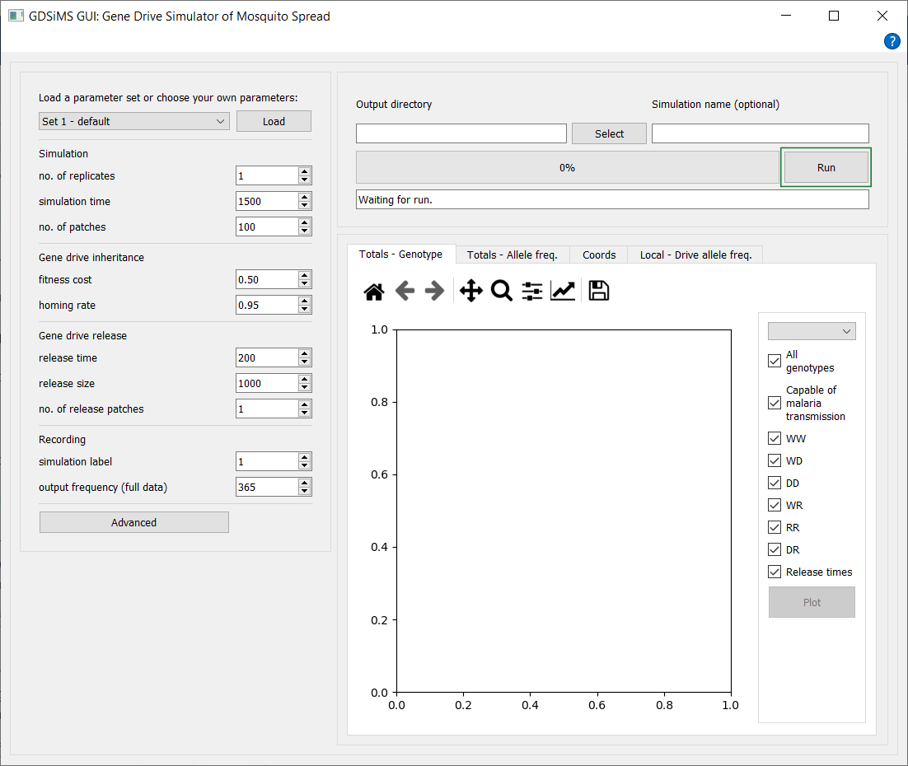

This will trigger the progress and message bar and the simulation will start running. An info message will pop up once it's done, letting us know that we can now plot our data. 

.. image:: ../images/gui_progress_snapshot.PNG
    :scale: 90 %

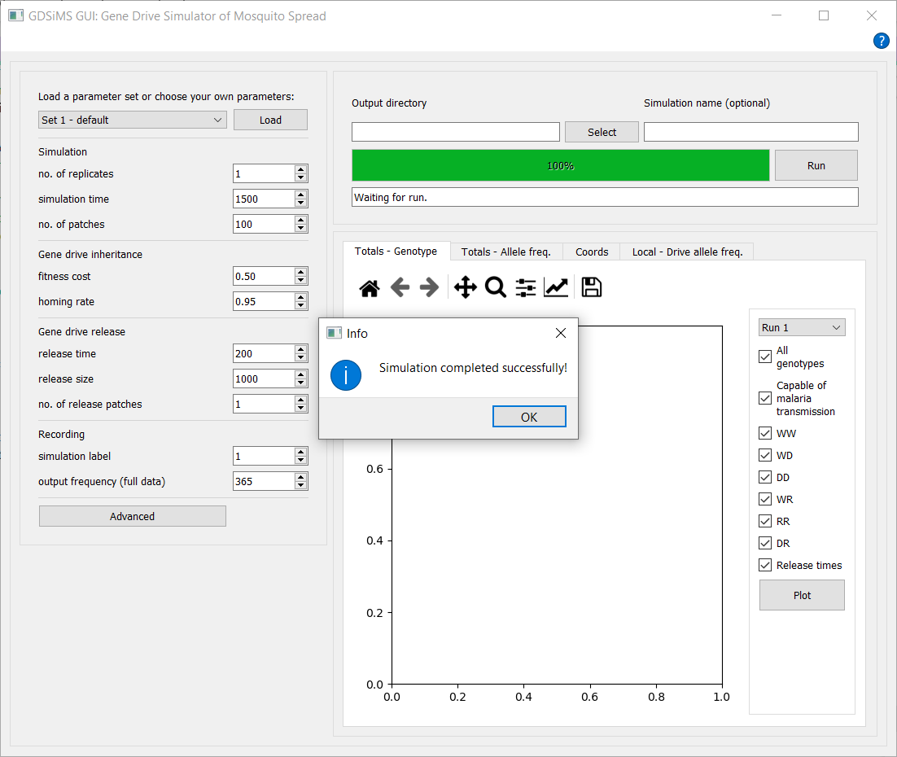

Then, go to the plotspace and click Plot.

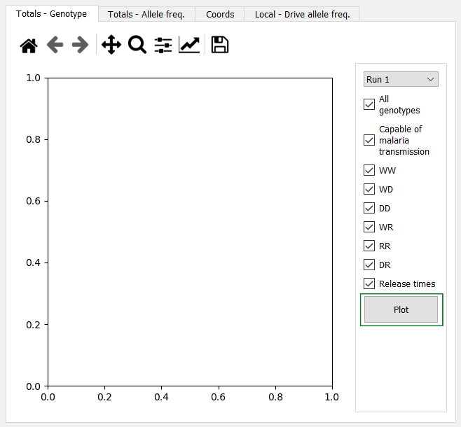

This will plot in the default plot tab selected, the "Totals - Genotype" tab.

You can change tabs at the top to see other available plots and animations. You can find details on these in the GUI :ref:`gui-plots` documentation section.

You can also check and uncheck genotypes in the sidebar and click Plot again to re-plot with different curves. You can hover over the genotypes to see a description. Other tabs have their own custom interaction options, which also offer hovering descriptions.

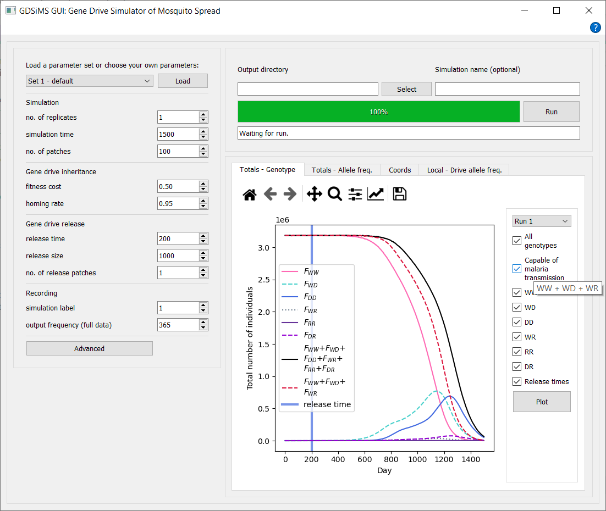

You can check out the parameters used and the output data in the app folder - the default location is different for Windows and Mac. 

For Windows, this is the ``_internal`` subfolder in the ``GDSiMS_Win`` folder. 

.. image:: ../images/gui_folder_gdsims_win.PNG
    :scale: 90 %

For Mac, you'll need to visit your computer's Applications folder (you can find this with the Finder) and find the GDSiMS app you've installed. Then, right-click on the app and click on 'Show Package Contents'. 

.. image:: ../images/gui_usage_mac_show_contents.jpg
    :scale: 50 %

Then, click on the ``Contents`` subfolder, and then on the ``Frameworks`` subfolder. 

For both Windows and Mac, at the respective locations specified, a date-time stamped folder will have been created with the time at which you started the simulation. This folder contains:

-	``params.txt`` file - file fed into the model program.

-	``paramsInfo.csv`` file - contains all parameter values used in the simulation and parameter descriptions.

-	``output_files`` folder - contains data files produced by the model program. More detail on these in the model program's :doc:`../user_guide/output` documentation page.

.. image:: ../images/gui_folder_internal.PNG
    :scale: 90 %

.. image:: ../images/gui_folder_sim.PNG
    :scale: 90 %

If you ever can't find this documentation website you can click on the Help button (icon in the top right-hand corner for Windows, Help tab in the window's tools bar at the top of the screen for Mac) to open it again. 

.. image:: ../images/gui_help_snapshot.PNG
    :scale: 90 %

Frequently Asked Questions
--------------------------

1. How do I load one of the pre-defined parameter sets?
^^^^^^^^^^^^^^^^^^^^^^^^^^^^^^^^^^^^^^^^^^^^^^^^^^^^^^^

Just go to the top left corner of the GUI and select a pre-defined set from the drop-down list. Then, click Load for the parameters to update. You can view a summary table of the parameter sets in the :ref:`gui-param-sets` section. This also includes the equivalent names for the GUI parameter names and the GDSiMS model parameter names so you can understand parameter documentation in other sections of this website. 

.. image:: ../images/gui_load_sets.PNG
    :scale: 80 %

2. I'd like to save my output data elsewhere, how do I do this?
^^^^^^^^^^^^^^^^^^^^^^^^^^^^^^^^^^^^^^^^^^^^^^^^^^^^^^^^^^^^^^^

You can use the two boxes above the progress bar to do this. Before running a simulation, select the output directory by clicking Select and choosing a folder in the Folder Explorer. You can then type your own simulation name for the simulation folder - the date-time stamp is used by default otherwise. 

.. image:: ../images/gui_choose_output_directory.PNG
    :scale: 80 %

3. I'd like to save a plot.
^^^^^^^^^^^^^^^^^^^^^^^^^^^

Just click the Save button on the plot toolbar at the top. You can select where to save the file to.

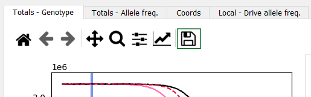

4. I'd like to save an animation.
^^^^^^^^^^^^^^^^^^^^^^^^^^^^^^^^^

Click the Save button underneath the Play button. You can select where to save the file to. Saving may take a while to process if the animation is long.

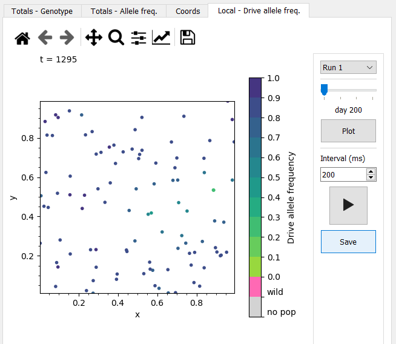

5. The recorded day interval on the animation is too large/too small. How do I set my desired day interval?
^^^^^^^^^^^^^^^^^^^^^^^^^^^^^^^^^^^^^^^^^^^^^^^^^^^^^^^^^^^^^^^^^^^^^^^^^^^^^^^^^^^^^^^^^^^^^^^^^^^^^^^^^^^

This corresponds to the "output frequency (full data)" parameter used to run the simulation. Make sure to set this to your desired day interval for the animation prior to running the simulation. By default, this is set to 365 days so local data isn't unnecessarily large. If you've already run the simulation, you'll have to change the parameter and re-run the simulation.

6. I'd like to change the labels, line colours or title on a plot.
^^^^^^^^^^^^^^^^^^^^^^^^^^^^^^^^^^^^^^^^^^^^^^^^^^^^^^^^^^^^^^^^^^

On the plot toolbar, click on the "Edit axes, curve and image parameters" icon (the graph icon with a rising arrow). Here you can edit axes labels and ranges on the Axes tab and curve colours, labels and styles in the Curves tab - click Ok when you're done. This should automatically update the plot. If you make any changes on the interactive sidebar and replot with the Plot button you'll have to make the same changes on the plot toolbar again. 

.. image:: ../images/gui_plot_edit_axes_icon.PNG
    :scale: 80 %

.. image:: ../images/gui_plot_edit_axes_window.PNG
    :scale: 80 %

7. I'd like to change the type of scale on a plot axis to e.g. a log scale.
^^^^^^^^^^^^^^^^^^^^^^^^^^^^^^^^^^^^^^^^^^^^^^^^^^^^^^^^^^^^^^^^^^^^^^^^^^^

As above, click on the "Edit axes, curve and image parameters" icon (the graph icon with a rising arrow) on the plot toolbar. You can change an axis scale by selecting from the Scale drop-down box for the respective axis. 

8. I'd like to run another simulation.
^^^^^^^^^^^^^^^^^^^^^^^^^^^^^^^^^^^^^^

Just tweak the parameters (and optionally select a different output directory or simulation name) and click Run again! Once it's done you can click Plot on the plot tabs to update the plots for the new simulation. The old ones will stay in window until then in case you want to look through them whilst you wait. The only caveat is if you've chosen your own simulation name for the previous simulation and you keep the same for the new one the application will prompt you to choose a different one. This is so previous output data is not mistakenly rewritten.

9. I'd like to cancel the simulation. It's taking too long, I've used the wrong parameters or there's an error.
^^^^^^^^^^^^^^^^^^^^^^^^^^^^^^^^^^^^^^^^^^^^^^^^^^^^^^^^^^^^^^^^^^^^^^^^^^^^^^^^^^^^^^^^^^^^^^^^^^^^^^^^^^^^^^^

If you've used the wrong parameters and the simulation doesn't take too long we'd recommend letting it finish running. Otherwise, you can click the Abort button that replaces the Run button when running a simulation. Please note that aborting a simulation is a last-resort option and is an intensive process. It will usually take 1-2 mins and might freeze the application. Don't click on anything else until it's done - a pop-up info message will let you know when it's done. If there are errors and it takes any longer than this, close the window with the close button (it may take a couple of clicks) and force quit the application (and contact us with some details on the issue).

.. image:: ../images/gui_abort_button.PNG
    :scale: 90 %

.. image:: ../images/gui_abort_message.PNG
    :scale: 70 %

Advanced tutorial 1: Coordinates file
-------------------------------------

You might want to select some coordinate grid pattern or add your own custom coordinates for the patch locations and select which of these are release sites. You can do this through the advanced coordinate settings.

1. Open the GUI and click on the Advanced button in the parameters section - this will open a new window dialog.

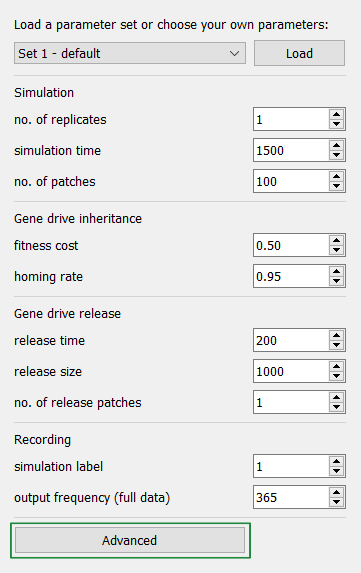

2. The custom coordinates file option is only available for an Edge boundary type in the GUI, so change this first with the boundary type drop-down. 

.. image:: ../images/gui_advanced_edge.PNG
    :scale: 80 %

3. This should display a patch coordinates file checkbox. Checking this will display a drop-down menu to choose default grid options. There are square and hexagonal grids available with a couple of different patch number options for each. Let's choose the first one, 'Square grid 25 patches'.

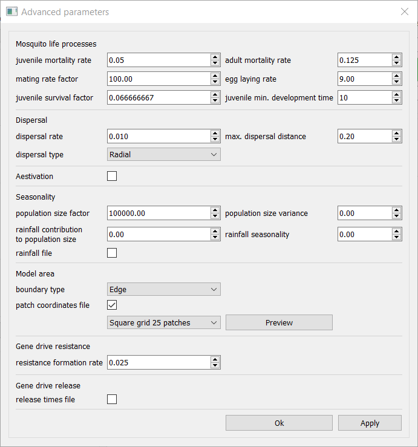

.. note::

    We can also select a custom coordinates file instead. 
    
    3. i. On the drop-down select 'Custom'. Create your coordinates file. The structure needed for this file is documented in the :ref:`coords_custom_file` section. You can also find example coordinates files `here <https://github.com/AceRNorth/gdsims/tree/main/docs/exercises>`_ - you can download them by clicking on the file and clicking on the 'Download raw file' icon. Let's use the ``coords_square_25.txt`` file as an example - it will be the same file that's used for the default 'Square grid 25 patches' option.

    3. ii. Selecting this will display a Select button much like the output directory selection button in the main window. Click Select to browse for your file in the File Explorer. 

    .. image:: ../images/gui_advanced_coords_custom.PNG
        :scale: 80 %

4. Before confirming your advanced parameter changes or previewing plots make sure the 'no. of patches' parameter in the main window matches with the number of patches included in your coordinates file. This is a sanity check to ensure you know how many patches will be used. In our example file we use 25 patches, so change this to 25.

5. Notice there is a preview button next to the drop-down bar. Clicking it will display a pop-up window with a preview plot of the coordinates, clearly indicating the release sites selected. Release sites have been pre-selected in the default options but you can choose your own in your custom files.

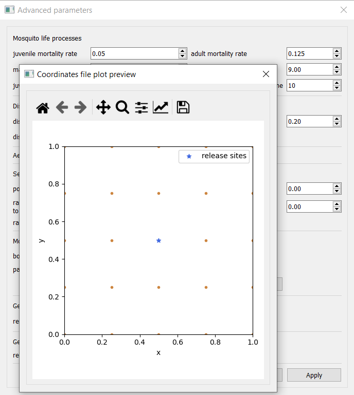

6. Confirm the changes by clicking Ok or Apply at the bottom of the advanced parameter window dialog. 

7. Run the simulation as usual! Once it's done you can check the placement of your coordinates in the Coords plot tab. It should look very similar to our preview:

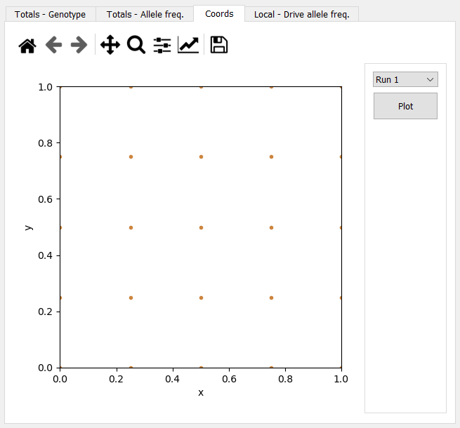

Advanced tutorial 2: Seasonality file
-------------------------------------

You might want to add a custom rainfall file to model your own seasonality. You can do this by adding your own rainfall file to the parameters. Details of the seasonality model default and custom options can be found in Tutorial :ref:`tutorial-7.1`.

1. Create your rainfall file. The structure needed for this file is documented in the :ref:`rainfall_file` section. You can also find example rainfall files `here <https://github.com/AceRNorth/gdsims/tree/main/docs/exercises>`_ - you can download them by clicking on the file and clicking on the 'Download raw file' icon. Let's use the ``rainfall.txt`` file as an example. 

2. Open the GUI and click on the Advanced button in the parameters section - this will open a new window dialog. 

3. The rainfall file checkbox is under the Seasonality section. Checking this will display a Select button much like the output directory selection button in the main window and a 'responsiveness to rainfall' parameter - we'll get to this parameter in the next step. Click Select to browse for your file in the File Explorer. 

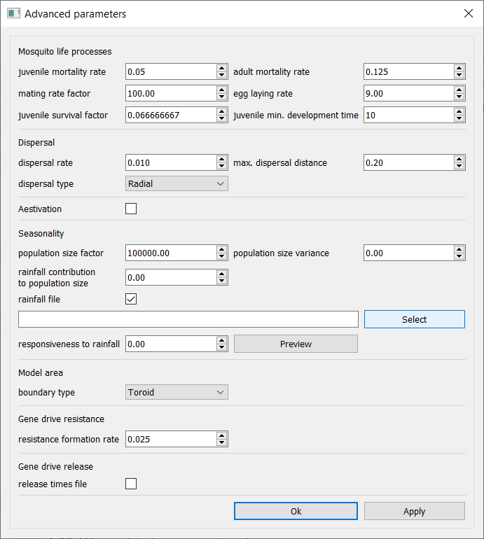

4. Tweak the 'responsiveness to rainfall' parameter - we can change it to 1.00. We might also wanna tweak some of the previous seasonality parameters so we can observe the rainfall effects on the plot more easily later on - let's change the 'population size factor' to 10000.00 and the 'rainfall contribution to population size' to 100000.00.

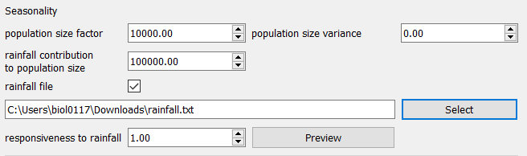

5. We can preview what the rainfall data in the file looks like by clicking Preview under the Select button. This will open a pop-up window with the preview plot. 

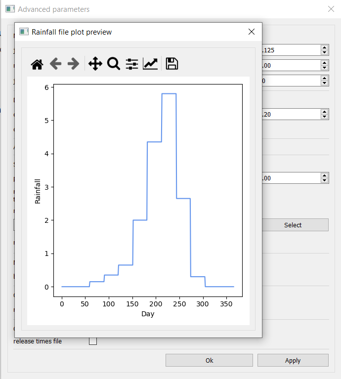

6. Confirm the changes by clicking Ok or Apply at the bottom of the advanced parameter window dialog. 

7. Run the simulation as usual! Once it's done you can check the totals plot to see the effect of seasonality on our total numbers of mosquitoes. For our example it should look like this:

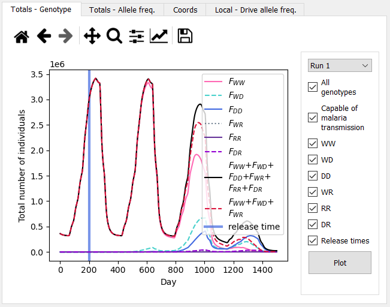

Advanced tutorial 3: Release times file
---------------------------------------

You might want to add a custom gene drive release schedule to your simulation. You've already learnt how to choose the release sites above and you can also add a file for the scheduled release times if you want more than one release time (instead of the default 'release time' parameter in the main window).

1. Create your release times file. The structure needed for this file is documented in the :ref:`release_times_file` section. You can also find an example release times file `here <https://github.com/AceRNorth/gdsims/tree/main/docs/exercises>`_ - you can download it by clicking on the file and clicking on the 'Download raw file' icon. Let's use the ``rel_times.txt`` file as an example. 

2. Open the GUI and click on the Advanced button in the parameters section - this will open a new window dialog. 

3. The release times file checkbox is under the Gene drive release section. Checking this will display a Select button - click it to browse for your file in the File Explorer. 

.. image:: ../images/gui_advanced_release_times_file.PNG
    :scale: 80 %

5. Confirm the changes by clicking Ok or Apply at the bottom of the advanced parameter window dialog. 

6. Run the simulation as usual! Once it's done you can open the totals genotype plot, uncheck all curves except WD, DD, DR and the release times lines from the sidebar and plot - this will allow us to focus on smaller changes in drive genotypes. Then, zoom into the beginning of the curves around days 200, 300 and 400 (the area with the release times bar) with the magnifying glass icon on the plot toolbar at the top. You just need to click on the icon and select the rectangle area on the plot to zoom into (and if you wanna go back to the original plot you can simply click the Home icon on the toolbar to reset it). We can see subtle bumps near these times, with a slight delay of 10-15 days after each release time, showing that gene drive mosquitoes are indeed being released then! The delay is due to **male** drive heterozygous mosquitoes being released. For the change to take effect in the adult mated females, we must wait for these males to mate, and their mated females to lay eggs with the new genotypes, and these eggs to grow into juveniles and ultimately into the mated heterozygous females we record. This agrees with the juvenile min. development time parameter we have used of 10 days.

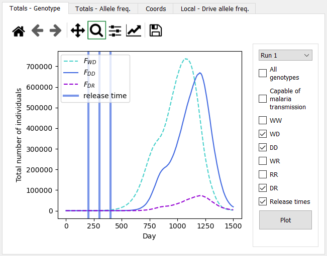

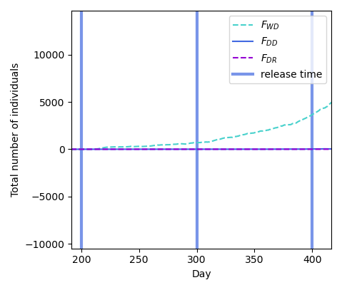