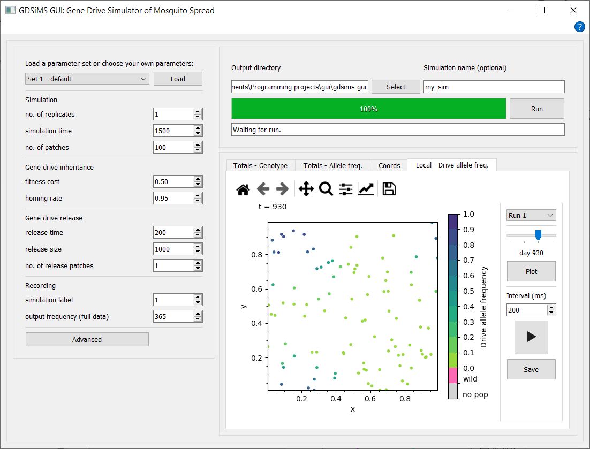

.. _gui-usage:

Usage
=====

The GUI provides features to enter model parameters, run the model program and view the output data. 

1. Load a parameter set from available pre-defined sets by selecting one from the drop-down and clicking Load. Parameters can also be tweaked at any time before running, including those in the advanced parameter window dialog. All parameter labels have tooltips which display descriptions when you hover over them.

2. Select an output data destination directory (i.e. folder) and choose the name for your simulation before clicking Run. The interface will give updates on the simulation's progress whilst it's running, and plotting options will become available upon completion of the simulation. 

   .. note::

        The GUI won't allow simulation folder names (in the same output destination folder) that have already been used to run a simulation. This is to prevent over-writing of files and confusion.

3. Choose from the tabs to view different plot and animation options, interact via the plot sidebar to select plotting parameters and click Plot or Play to update the canvas.

.. caution:: 

        If the simulation has issues when running, please attempt to click the Abort button (which replaces the Run button when the simulation is running) before closing the window. Aborting may take a while and may freeze the application as it's an intensive and last-resort process but if 1-2 mins have passed with no change, force quit the application. 

Output files
------------

By default, the output files will be created in the ``_internal`` subfolder for Windows (found in the folder you ran the ``GDSiMS.exe`` file from), and in the app's ``Contents/Frameworks/`` subfolder for Mac. You can access the app's contents on Mac by right-clicking on the GDSiMS app in your Applications folder and choosing "Show Package Contents". 

.. image:: ../images/gui_usage_mac_show_contents.jpg
    :scale: 60 %

Alternatively, an output destination directory (i.e. folder) can be selected on the GUI before running the simulation. 

A simulation folder will be created at the output destination upon each simulation run. The name of this folder will be the simulation name you provided before running. This is optional and if not provided, the app will name the folder with a date-time stamp of the simulation start time. 

Three objects are created in the simulation folder:

-	``params.txt`` file - file fed into the model program.

-	``paramsInfo.csv`` file - contains all parameter values used in the simulation and parameter descriptions.

-	``output_files`` folder - contains data files produced by the model program. More detail on these in the model program's :doc:`../user_guide/output` documentation page.

.. _gui-param-sets:

Pre-defined parameter sets
---------------------------

The values for the pre-defined parameter sets in the GDSiMS GUI are below. These sets are different to the ones provided by GDSiMS. More information on model parameters can be found in the model program's :doc:`../user_guide/user_guide_root`

+------------------------------------+-------------------------+-------------+-------------+-------------+-------------+-------------+-------------+
|                                    |                         | Set 1       | Set 2       | Set 3       | Set 4       | Set 5       | Set 6       | 
+------------------------------------+-------------------------+-------------+-------------+-------------+-------------+-------------+-------------+
| Parameter                          |  Model program          | default     | low fitness | high        | high number | low         | high        | 
|                                    |  equivalent             |             | cost        | fitness     | of          | dispersal   | dispersal   | 
|                                    |                         |             |             | cost        | release     | rate        | rate        | 
|                                    |                         |             |             |             | sites       |             |             |
+====================================+=========================+=============+=============+=============+=============+=============+=============+
| no. of replicates                  | ``num_runs``            |      1      |      1      |      1      |      1      |      1      |      1      |
+------------------------------------+-------------------------+-------------+-------------+-------------+-------------+-------------+-------------+
| simulation time                    | ``max_t``               |     1500    |     1500    |     1500    |     1500    |     1500    |     1500    |
+------------------------------------+-------------------------+-------------+-------------+-------------+-------------+-------------+-------------+
| no. of patches                     | ``num_pat``             |      100    |     100     |     100     |     100     |     100     |     100     |
+------------------------------------+-------------------------+-------------+-------------+-------------+-------------+-------------+-------------+
| juvenile mortality rate            | ``mu_j``                |     0.05    |     0.05    |     0.05    |     0.05    |     0.05    |     0.05    |
+------------------------------------+-------------------------+-------------+-------------+-------------+-------------+-------------+-------------+
| adult mortality rate               | ``mu_a``                |     0.125   |     0.125   |     0.125   |     0.125   |     0.125   |     0.125   | 
+------------------------------------+-------------------------+-------------+-------------+-------------+-------------+-------------+-------------+
| mating rate factor                 | ``beta``                |    100.0    |    100.0    |    100.0    |    100.0    |    100.0    |    100.0    |
+------------------------------------+-------------------------+-------------+-------------+-------------+-------------+-------------+-------------+
| egg laying rate                    | ``theta``               |     9.0     |     9.0     |     9.0     |     9.0     |     9.0     |     9.0     | 
+------------------------------------+-------------------------+-------------+-------------+-------------+-------------+-------------+-------------+
| juvenile survival factor           | ``comp_power``          | 0.066666667 | 0.066666667 | 0.066666667 | 0.066666667 | 0.066666667 | 0.066666667 | 
+------------------------------------+-------------------------+-------------+-------------+-------------+-------------+-------------+-------------+
| juvenile min. development time     | ``min_dev``             |     10      |     10      |     10      |     10      |     10      |     10      | 
+------------------------------------+-------------------------+-------------+-------------+-------------+-------------+-------------+-------------+
| resistance formation rate          | ``gamma``               |    0.025    |    0.025    |    0.025    |    0.025    |    0.025    |    0.025    | 
+------------------------------------+-------------------------+-------------+-------------+-------------+-------------+-------------+-------------+
| fitness cost                       | ``xi``                  |     0.5     |     0.5     |     0.5     |     0.5     |     0.5     |     0.5     | 
+------------------------------------+-------------------------+-------------+-------------+-------------+-------------+-------------+-------------+
| homing rate                        | ``e``                   |    0.95     |    0.95     |    0.95     |    0.95     |    0.95     |    0.95     |  
+------------------------------------+-------------------------+-------------+-------------+-------------+-------------+-------------+-------------+
| release time                       | ``driver_start``        |     200     |     200     |     200     |     200     |     200     |     200     | 
+------------------------------------+-------------------------+-------------+-------------+-------------+-------------+-------------+-------------+
| release size                       | ``num_driver_M``        |    1000     |    1000     |    1000     |    1000     |    1000     |    1000     |
+------------------------------------+-------------------------+-------------+-------------+-------------+-------------+-------------+-------------+
| no. of release patches             | ``num_driver_sites``    |      1      |      1      |      1      |      1      |      1      |      1      |
+------------------------------------+-------------------------+-------------+-------------+-------------+-------------+-------------+-------------+
| dispersal rate                     | ``disp_rate``           |     0.01    |     0.01    |     0.01    |     0.01    |     0.01    |     0.01    |
+------------------------------------+-------------------------+-------------+-------------+-------------+-------------+-------------+-------------+
| max. dispersal distance            | ``max_disp``            |     0.2     |     0.2     |     0.2     |     0.2     |     0.2     |     0.2     | 
+------------------------------------+-------------------------+-------------+-------------+-------------+-------------+-------------+-------------+
| aestivation rate                   | ``psi``                 |     0.0     |     0.0     |     0.0     |     0.0     |     0.0     |     0.0     |
+------------------------------------+-------------------------+-------------+-------------+-------------+-------------+-------------+-------------+
| aestivation mortality              | ``mu_aes``              |     0.0     |     0.0     |     0.0     |     0.0     |     0.0     |     0.0     |
+------------------------------------+-------------------------+-------------+-------------+-------------+-------------+-------------+-------------+
| start hiding date                  | ``t_hide1``             |      0      |      0      |      0      |      0      |      0      |      0      | 
+------------------------------------+-------------------------+-------------+-------------+-------------+-------------+-------------+-------------+
| end hiding date                    | ``t_hide2``             |      0      |      0      |      0      |      0      |      0      |      0      |
+------------------------------------+-------------------------+-------------+-------------+-------------+-------------+-------------+-------------+
| start waking date                  | ``t_wake1``             |      0      |      0      |      0      |      0      |      0      |      0      |
+------------------------------------+-------------------------+-------------+-------------+-------------+-------------+-------------+-------------+
| end waking date                    | ``t_wake2``             |      0      |      0      |      0      |      0      |      0      |      0      |
+------------------------------------+-------------------------+-------------+-------------+-------------+-------------+-------------+-------------+
| population size factor             | ``alpha0_mean``         |   100000.0  |   100000.0  |   100000.0  |   100000.0  |   100000.0  |   100000.0  |
+------------------------------------+-------------------------+-------------+-------------+-------------+-------------+-------------+-------------+
| population size variance           | ``alpha0_variance``     |     0.0     |     0.0     |     0.0     |     0.0     |     0.0     |     0.0     |
+------------------------------------+-------------------------+-------------+-------------+-------------+-------------+-------------+-------------+
| rainfall contribution to pop. size | ``alpha1``              |     0.0     |     0.0     |     0.0     |     0.0     |     0.0     |     0.0     |
+------------------------------------+-------------------------+-------------+-------------+-------------+-------------+-------------+-------------+
| rainfall seasonality               | ``amp``                 |     0.0     |     0.0     |     0.0     |     0.0     |     0.0     |     0.0     |
+------------------------------------+-------------------------+-------------+-------------+-------------+-------------+-------------+-------------+
| responsiveness to rainfall         | ``resp``                |     0.0     |     0.0     |     0.0     |     0.0     |     0.0     |     0.0     |
+------------------------------------+-------------------------+-------------+-------------+-------------+-------------+-------------+-------------+
| output start (full data)           | ``rec_start``           |     200     |     200     |     200     |     200     |     200     |     200     | 
+------------------------------------+-------------------------+-------------+-------------+-------------+-------------+-------------+-------------+
| output end (full data)             | ``rec_end``             |    1500     |    1500     |    1500     |    1500     |    1500     |    1500     |
+------------------------------------+-------------------------+-------------+-------------+-------------+-------------+-------------+-------------+
| output frequency (summary data)    | ``rec_interval_global`` |      1      |      1      |      1      |      1      |      1      |      1      |
+------------------------------------+-------------------------+-------------+-------------+-------------+-------------+-------------+-------------+
| output frequency (full data)       | ``rec_interval_local``  |     365     |     365     |     365     |     365     |     365     |     365     |
+------------------------------------+-------------------------+-------------+-------------+-------------+-------------+-------------+-------------+
| local site freq.                   | ``rec_sites_freq``      |      1      |      1      |      1      |      1      |      1      |      1      |
+------------------------------------+-------------------------+-------------+-------------+-------------+-------------+-------------+-------------+
| simulation label                   | ``set_label``           |      1      |      2      |      3      |      4      |      5      |      6      | 
+------------------------------------+-------------------------+-------------+-------------+-------------+-------------+-------------+-------------+
| dispersal type                     |                         |    Radial   |    Radial   |    Radial   |    Radial   |    Radial   |    Radial   |
+------------------------------------+-------------------------+-------------+-------------+-------------+-------------+-------------+-------------+
| boundary type                      |                         |    Toroid   |    Toroid   |    Toroid   |    Toroid   |    Toroid   |    Toroid   |
+------------------------------------+-------------------------+-------------+-------------+-------------+-------------+-------------+-------------+
| rainfall file                      |                         |     None    |     None    |     None    |     None    |     None    |     None    |
+------------------------------------+-------------------------+-------------+-------------+-------------+-------------+-------------+-------------+
| patch coordinates file             |                         |     None    |     None    |     None    |     None    |     None    |     None    |
+------------------------------------+-------------------------+-------------+-------------+-------------+-------------+-------------+-------------+
| release times file                 |                         |     None    |     None    |     None    |     None    |     None    |     None    |
+------------------------------------+-------------------------+-------------+-------------+-------------+-------------+-------------+-------------+

Advanced parameter window
-------------------------

Advanced parameters can be accessed by clicking the Advanced button at the bottom of the parameters section. For more information on the model's advanced options visit the :doc:`../user_guide/adv_options` page.

Note that patch coordinates file selection will only show when an Edge boundary type is selected. 

Also note that the default dispersal type in the GUI is Radial - this differs from GDSiMS, where the default is Distance kernel.

.. image:: ../images/gui_usage_adv_window.png
    :scale: 70 %

.. caution::

   If the advanced parameter window is closed with the close button, changes won't be applied. Please use the Ok or Apply buttons to confirm changes. 

.. _gui-plots:

Plots
-----

Each plot tab has a `navigation bar <https://matplotlib.org/3.2.2/users/navigation_toolbar.html>`_ above the plot canvas which can be used to save the figure, modify axes labels, titles, change the type of axes scales… 

Each tab also has an interaction section where run number (i.e. simulation repetition index) can be selected from the drop-down and plotted. Other options are provided depending on the plot.

Current plot tabs available:

Totals - Genotype
^^^^^^^^^^^^^^^^^

A plot of the total number of adult male mosquitoes over all sites for each day of the simulation. This includes plot lines for the different genotypes modelled - plot lines can be selected and re-plotted by clicking Plot again. Hover over the labels in the interaction sidebar to see descriptions for these. This plot uses data from the :ref:`totals_file`. W is a wild-type allele, D is a drive-type allele and R is a non-functional resistance allele.

Totals - Allele frequency
^^^^^^^^^^^^^^^^^^^^^^^^^

Similar to the above, where allele frequencies for the wild-type (W), drive-type (D) and non-functional resistance alleles (R) over the six available genotype combinations and over time have been calculated. 

e.g. for wild-type allele on one day

.. math::
    \text{W}_{\text{freq}} = \frac{\text{F}_{\text{WW}} + \text{F}_{\text{WD}} + \text{F}_{\text{WR}}}{\text{F}_{\text{WW}} + \text{F}_{\text{WD}} + \text{F}_{\text{DD}} + \text{F}_{\text{WR}} + \text{F}_{\text{RR}} + \text{F}_{\text{DR}}}

Coordinates 
^^^^^^^^^^^

Patch coordinates plot of all modelled population sites using data from the :ref:`coords_output_file`.

Local - drive allele frequency
^^^^^^^^^^^^^^^^^^^^^^^^^^^^^^

This combines a plot and an animation option in the same plotspace. Adjust the slider and click Plot to (re-)plot a snapshot of the local populations' (i.e. patches') drive allele frequencies at the chosen simulation day. Alternatively, choose the frame interval for the animation and click the Play button. This animation can be saved as a GIF file by clicking Save. The plot and animation use data from the :ref:`coords_output_file` and :ref:`local_output_file`.

.. note::

    Plots will not be plotted (or updated) until the Plot button of the respective tab is clicked. 

